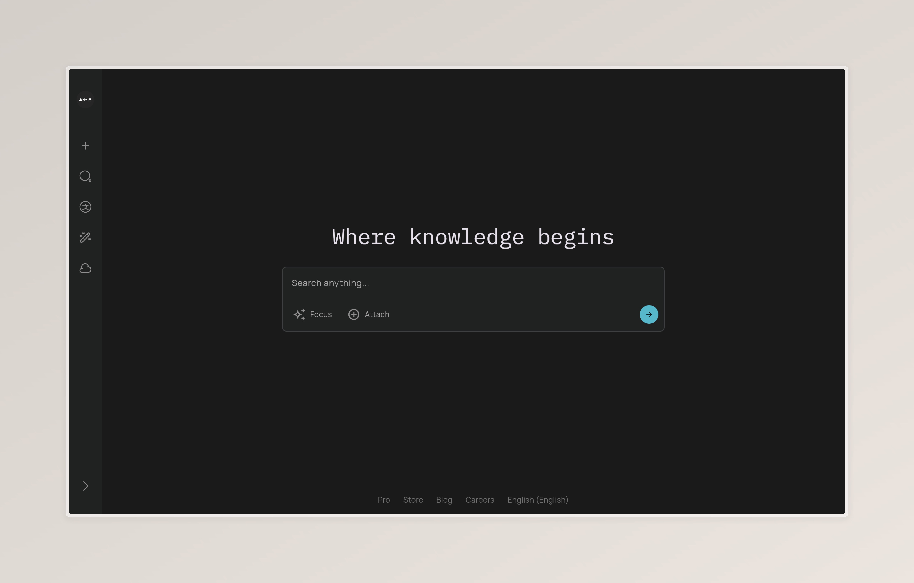
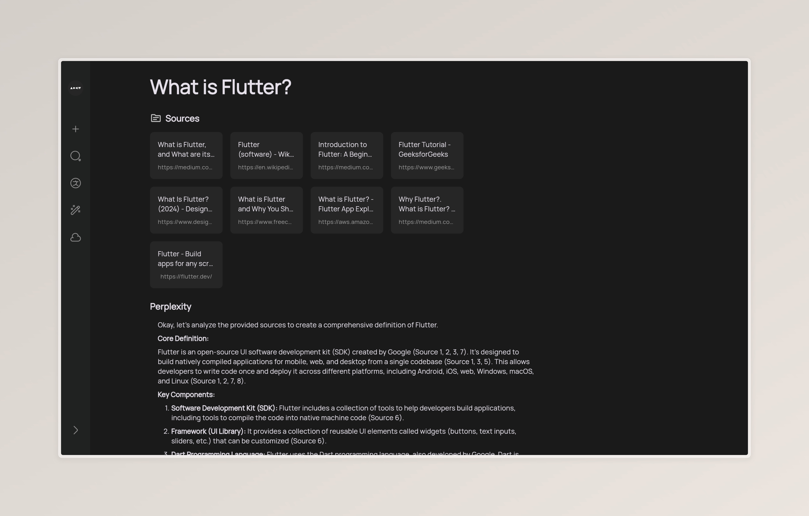

# perplexity_clone

A new Flutter project that integrates with a generative AI service for enhanced responses based on web search results.

## Getting Started

This project is a starting point for a Flutter application that utilizes the `LLMService` to generate responses based on user queries and search results.

### Prerequisites

- Python 3.x
- Flutter SDK
- Required Python packages (e.g., `google.generativeai`)

### Installation

1. Clone the repository:
   ```bash
   git clone <repository-url>
   cd perplexity_clone
   ```

2. Install the required Python packages:
   ```bash
   pip install -r requirements.txt
   ```

3. Set up your environment variables for the API key:
   ```bash
   export GEMINI_API_KEY=<your_api_key>
   ```

### Usage

The `LLMService` class is designed to generate responses based on a query and a list of search results. Here’s how to use it:

1. Import the `LLMService` in your Python code:
   ```python
   from server.services.llm_service import LLMService
   ```

2. Create an instance of `LLMService`:
   ```python
   llm_service = LLMService()
   ```

3. Call the `generate_response` method with your query and search results:
   ```python
   query = "What is the impact of climate change?"
   search_results = [
       {"url": "https://example.com/article1", "content": "Content from article 1."},
       {"url": "https://example.com/article2", "content": "Content from article 2."}
   ]

   response = llm_service.generate_response(query, search_results)
   for chunk in response:
       print(chunk)
   ```

### Screenshots

Here are some screenshots of the application in action:

#### Home Screen


#### Response Display



